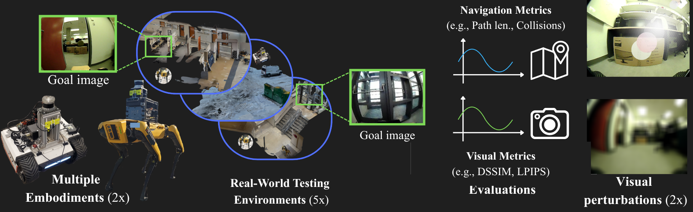
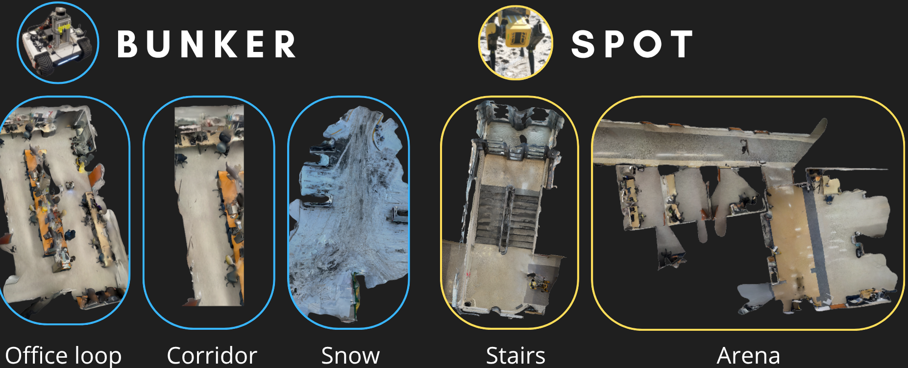
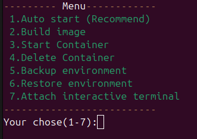
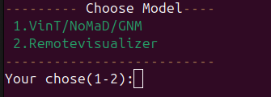
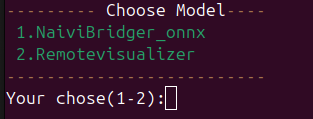
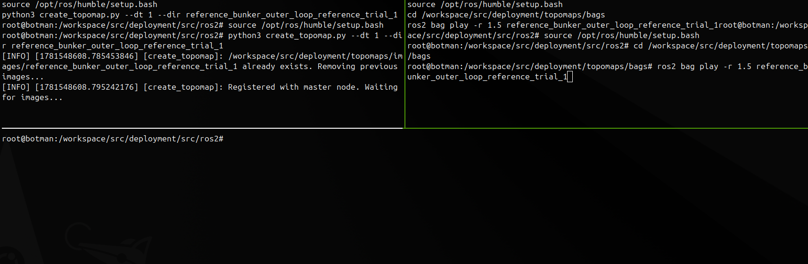
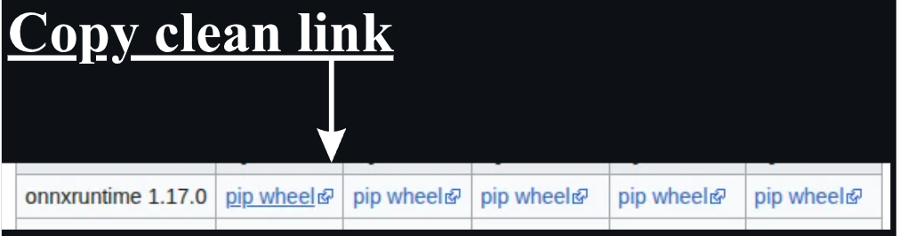

# Can Vision Foundation Models Navigate?
### Zero-Shot Real-World Evaluation and Lessons Learned

**[Maeva Guerrier](https://scholar.google.com/citations?hl=fr&user=4-GRCBsAAAAJ), [Karthik Soma](https://scholar.google.com/citations?hl=fr&user=eJ5jLXoAAAAJ), [Jana Pavlasek](https://scholar.google.com/citations?hl=fr&user=yJS-u7IAAAAJ), [Giovanni Beltrame](https://scholar.google.com/citations?hl=fr&user=TVHJJ9wAAAAJ)**  
*Polytechnique Montréal, MILA*

[](https://arxiv.org/abs/2603.25937)
[](https://maevaguerrier.github.io/papers-pages/zero-shot-eval.html)
[](https://drive.google.com/drive/folders/11s3vYHmx7elXd8YxlTHuNcHSYYwudF6D?usp=drive_link)
[](https://huggingface.co/LearningMae/vnm_zeroshot_eval)


[](LICENSE)


---

This repository contains the official codebase for deploying the models directly onboard your robots. 

## Overview 🔎

Visual Navigation Models (VNMs) promise generalizable robot navigation by learning from large-scale visual demonstrations. Yet existing evaluations rely almost exclusively on **success rate** — whether the robot reaches its goal — which conceals trajectory quality, collision behavior, and robustness to environmental change.

This work provides a **comprehensive real-world evaluation** of five state-of-the-art VNMs across two robot platforms and five environments. We go beyond success rate by combining path-based metrics with vision-based goal-recognition scores and controlled robustness testing.

<p align="center">
  
</p>

---

## TODOs 📝

### ONNX models
- [ ] HF Datasets 
- [ ] IEEE Data port if HF down

### Documentations
- [ ] rviz remote visualizer 


---

## Key Findings 🔑

Three systematic limitations are identified across all evaluated architectures:

1. **Limited geometric understanding** — Even diffusion- and transformer-based models exhibit frequent collisions. Architectural sophistication does not guarantee safe navigation.
2. **Goal confusion in repetitive environments** — Models fail to discriminate between perceptually similar locations, causing premature or incorrect goal predictions.
3. **Fragility under distribution shift** — Performance degrades noticeably under motion blur, sunflare, and out-of-distribution environments (e.g., snow).

A surprising result: **simpler architectures (GNM/MobileNetV2) match complex transformer and diffusion models** across several metrics, suggesting data insufficiency limits the newer models more than architectural capacity.

---

## Models Evaluated

| Model | Backbone | Key Feature | Output |
|---|---|---|---|
| [GNM](https://arxiv.org/abs/2210.03370) | Fully Connected | Shared action space | Waypoints + distance |
| [ViNT](https://arxiv.org/abs/2306.14846) | Transformer | Goal fusion token | Waypoint + distance |
| [NoMaD](https://arxiv.org/abs/2310.07896) | Diffusion | Goal masking for exploration | Trajectory |
| [NaviBridger](https://arxiv.org/abs/2504.10041) | Diffusion | Learned action prior | Trajectory |
| [CrossFormer](https://arxiv.org/abs/2408.11812) | Transformer | Embodiment-specific heads | Waypoint |

---

## Environments 🌍

Five real-world environments of increasing difficulty, deployed on two robot platforms (**Bunker** tracked robot, **Spot** quadruped):

| Environment | Platform | Length | Description |
|---|---|---|---|
| **Corridor** | Bunker | 3.75 m | Short-horizon straight-line, goal = cardboard box |
| **Stairs** | Spot | 6.25 m | Ascending staircase; two visually identical staircases |
| **Office Loop** | Bunker | 27.96 m | Full office loop; cluttered long-horizon setting |
| **Arena** | Spot | 20.05 m | Doorway navigation; three similar doors, one target |
| **Snow** | Bunker | 18.96 m | Outdoor snowy parking lot; significant OOD shift |

&nbsp;

<p align="center">
  
</p>

---

## Metrics 🎯

We evaluate across three complementary domains:

**Path quality** 📊📉
- Path length
- Distance to goal (checkpoint-based)
- Collision occurrence
- Topological node error

**Visual perception** 👀
- Goal prediction accuracy
- LPIPS, PSNR, DSSIM (perceptual similarity at goal)

**Robustness** 💪
- Motion blur perturbation on topological map
- Sunflare perturbation on topological map

---

## WIP - Getting Started

### Prerequisites 💻

**Fisheye:** We recommend using a fisheye camera for deployment, as the models were trained predominantly on fisheye RGB data. Standard RGB cameras are supported but may result in degraded performance.

**Docker:** version 29.1.1

**Jetson Orin JetPack 6.2.1 running L4T Linux for Tegra R36.4.4:** *(optional — onboard deployment is recommended, but you can also run inference on a separate machine and send `cmd_vel` commands to the robot over ROS2)*:

| Category | Parameter | Value / Detail |
| :--- | :--- | :--- |
| **Hardware & Platform** | Hardware Model | NVIDIA Jetson AGX Orin Developer Kit |
| | Chip ID | `0x23` (Tegra234 / Orin) |
| | Architecture / EABI | `aarch64` |
| | Active Spec (TNSPEC) | `3701-501-0005-G.0-1-1-jetson-agx-orin-devkit-` |
| | Compatible Spec | `3701--0005--1--jetson-agx-orin-devkit-` |
| **Storage & Boot** | Tegra Boot Storage | `mmcblk0` (eMMC / Primary Storage) |
| | OTA Boot Device | `/dev/mtdblock0` |
| | OTA GPT Device | `/dev/mtdblock0` |
| **JetPack Ecosystem** | Meta-Package Version | `6.2.1+b38` (JetPack 6.2.1) |
| | Dev Extensions | `6.2.1+b38` (Development Meta Package) |
| | Runtime Stack | `6.2.1+b38` (Runtime Meta Package) |
| **L4T BSP & Kernel** | L4T Release Baseline | `R36` (Release) |
| | BSP Revision | `4.4` (L4T 36.4.4) |
| | Kernel Variant | `oot` (Out-of-Tree drivers enabled) |
| | Build GCID | `41062509` |
| | Build Date | `Mon Jun 16 16:07:13 UTC 2025` |
| **Userspace & Paths** | Target Library Dir | `nvidia` |
| | Target Library Path | `/usr/lib/aarch64-linux-gnu/nvidia` |

### Repository Structure

The `main` branch contains documentation only. Each model has its own dedicated branch, with the exception of GNM, ViNT, and NoMaD which share a single branch.
Each branch follows a consistent structure:
```
├── .devcontainer/
├── src/
├─── [subfolder(*optional)]/deployment/src/ros[1|2]
├─── train
├── third_party/
├── init_submodule.sh
├── docker_setup.sh
└── init_project.sh
```


### Clone the repository 

1. ```git clone git@github.com:MaevaGuerrier/vnm-zeroshot-eval.git```.
2. Go to he branch for the model you intend to deploy (GNM, ViNT, NoMaD &longrightarrow; **branch - ros2/nomad**; NaviBridger &longrightarrow; **branch - ros2/navibridger**; &longrightarrow; **branch - bunker/crossformer**) ```git checkout {branch}```.


### Download Pretrained Weights

Download model weights (ONNX format) for GNM, ViNT, NoMaD, NaviBridger, and CrossFormer:

[](https://drive.google.com/drive/folders/11s3vYHmx7elXd8YxlTHuNcHSYYwudF6D?usp=drive_link)
[](https://huggingface.co/LearningMae/vnm_zeroshot_eval)


Our onnx models are made for **Nvidia Jetson Orin**, however we provide convertion script as well if your onnxruntime version or jetpack version clashes with each other. (**See the Troubleshooting section**)


### Setup for Deployment


1. **Prerequisite**: Add you camera topic name ```src/[subfolder]/deployment/topic_names.py``` in the field ```IMAGE_TOPIC```.
2. **Prerequisite**: Add you cmd_vel topic name ```src/[subfolder]/deployment/config/robot.yaml``` in the field ```vel_navi_topic```.
3. *Optional*: You can change the maximum linear and agular velocity in ```src/[subfolder]/deployment/config/robot.yaml``` in the field ```max_v``` and ```max_w``` respectively.


**1. Initialize submodules**
```bash
./init_submodule.sh
```
This will initialize the required submodules and third-party dependencies.

**2. Build and run the Docker container**
```bash
./docker_setup.sh
```

<p align="left">
  
</p>


On first use, select **Option 1 - Auto start** to build and start the container. Once built, you never need
to rebuild it - use **Option3 - Start container** on subsequent runs.

If you want to open an additional terminal inside a running container, run the script
again and select **Option 7 — Attach terminal**.

> **Note:** The Docker container mounts the repository folder as a shared workspace,
> so any local changes are immediately accessible inside the container without rebuilding.

If the build fails, refer to the [Troubleshooting](#troubleshooting) section.


> **Note:** Vizualization of the docker menu for GNM/NoMaD, ViNT and Navirbidger, Crossformer is the same as shown in 2.
> The remote visualizer can be used to for rviz2 (WIP)

<p align="left">
  
  
</p>


**3. Intialize aliases and packages**
> **Note:** You must be inside the docker container for the following instruction.
```bash
./init_project.sh
```

### Deployment ROS2:


> **Note:** **You must be inside the docker container for all the following instruction**.
> We assume that you have a working ROS2 setup for your robot (*that have an onbaord camera streaming RGB images and uses a command velocity control*).
> Given that ROS1 reached its end of life the deployment focuses on ROS2 however we provided ROS1 file in src/[subfolder]/deployment/src/ros[1|2]
---

VNMs navigate using a topological map. To create one, manually drive the robot along the **reference trajectory** while recording a rosbag of the `IMAGE_TOPIC` specified in `src/[subfolder]/deployment/topic_names.py`.

**Place the recorded bag inside ```src/[subfolder]/deployment/topomaps/bags```**

*Topological map:* 
```
topo {topological_map_name} {bag_filename}
```
where topological_map_name is the name you want to give as your topological map and bag_filename is the one you recorded as the **reference trajectory**.
The command will show the following, note that this uses [tmux](https://github.com/tmux/tmux/wiki/), to navigate the pannels use *ctrl+B then arrow press*:
<p align="left">
  
</p>

```rosbag play -r 1.5 <bag_filename>```: Plays the rosbag at 1.5x speed, so the recording script captures nodes 1.5 seconds apart. You can adjust this value as needed. Note that all topological maps used in our evaluation were created this way.

---

*Aliases for easy deployment:* 
> **Note:** Those aliases are made for the onnx navigation stack if you have issues with the onnx model refer to the [Troubleshooting](#troubleshooting) section .

The aliases are the following  *gnm*,*vint*,*nomad* (**branch ros2/nomad**); *bridger* (**ros2/navibridger**) and *cross* (**bunker/crossformer**). 
All aliases follow command strcutrue: 
```
{alias_name} "--dir <topological_map_name> [--<flag> <value> ...]"
```
**The double quotes need to be included.**
**This assume that your are running your robot launch file as well (streaming RGB images and listening to the topic defined as the linear and angular topic e.g., cmd_vel).**


## WIP - Dataset

> **Dataset explanation coming soon.**

The evaluation dataset includes ROS/ROS2 bag files for all environments and all model deployments. (*We will provide a conversion tool to go from ROS to ROS2 and vice versa.*)
Each trial logs: odometry, node predictions, goal detection events, CPU/GPU/memory usage, and inference time.

The Dataset can be found [here](https://ieee-dataport.org/documents/can-vision-foundation-models-navigate-zero-shot-real-world-evaluation-and-lessons-learned).
> Note: This is a partial release of the dataset due to privacy and anonymization issues. Some data has been temporarily withheld because it contains identifiable human faces and legible vehicle license plates. We are actively trying to safely anonymize the remaining data for a future update.

---


## Troubleshooting 🆘

### My inference time is too high 

ONNX models can occasionally show higher inference latency on the first few seconds, and brief stalls may also occur due to graph optimization. However, if inference time remains consistently high, check that the GPU is being used — you may need to install a different version of `onnxruntime-gpu` (see the section below). To check that GPU is available for onnx, **inside the docker** do:
```
python3
import onnxruntime as ort
sess = ort.InferenceSession("path_to_onnx/model.onnx", providers=["CUDAExecutionProvider", "CPUExecutionProvider"])
print(sess.get_providers())
```
If ```CUDAExecutionProvider``` appears first in the output, the GPU is being used. If you only see ```CPUExecutionProvider```, ONNX Runtime fell back to CPU.


### ONNX runtime erros

Depending on your jetpack version there might be incompatibilities with the onnx models. 
Refer to [Jetson Zoo](https://elinux.org/Jetson_Zoo#ONNX_Runtime) and modify in the docker file ```(.devcontainer/{model_name}/Dockerfile)``` the onnxruntime gpu install:

**Change the following**
```
RUN wget https://nvidia.box.com/shared/static/48dtuob7meiw6ebgfsfqakc9vse62sg4.whl -O onnxruntime_gpu-1.18.0-cp310-cp310-linux_aarch64.whl && \
    pip install --no-deps onnxruntime_gpu-1.18.0-cp310-cp310-linux_aarch64.whl && \
    rm onnxruntime_gpu-1.18.0-cp310-cp310-linux_aarch64.whl 
```
**into**
```
RUN wget {clean_link} -O onnxruntime_gpu-{version}-cp310-cp310-linux_aarch64.whl && \
    pip install --no-deps onnxruntime_gpu-{version}-cp310-cp310-linux_aarch64.whl && \
    rm onnxruntime_gpu-{version}-cp310-cp310-linux_aarch64.whl 
```
<p align="left">
  
</p>

**REBULD the docker see option 2 in section Setup for Deployment.2**

> Note the onnx version might need changes as well try first without changing then see what version is compatible with the chosen onnxruntime wheel.
> The ONNX models are cross-platform compatible but if you need to rebuilt it see section below.

### How to rebuild the onnx models

Go into the folder ```src/[subfolder]/deployment/src/``` and use the python file ```{model}_to_onnx```, beforehand change the name of the model *(.pth)* file into the line ```model_name={name}```.

### Docker build issues 

If your jetson orin is not compatible with the base docker image **dustynv/l4t-pytorch:r36.2.0**  you may try to change the base image using images from [jetson-containers](https://github.com/dusty-nv/jetson-containers?tab=readme-ov-file). 
This setup can require some trial and error depending on your environment. If you get stuck, feel free to open an issue and we'll be happy to help.

### Message waiting for images


Double check your camera topic name ```src/[subfolder]/deployment/topic_names.py``` in the field ```IMAGE_TOPIC```.
Check that your images are being streamed by doing:
```
ros2 topic hz camera_topic_name
```


---


## Citation 🖊️

If you use this work, please cite:

```bibtex
@article{guerrier2026vnm,
  title   = {Can Vision Foundation Models Navigate? Zero-Shot Real-World Evaluation and Lessons Learned},
  author  = {Guerrier, Maeva and Soma, Karthik and Pavlasek, Jana and Beltrame, Giovanni},
  journal = {arXiv preprint arXiv:2603.25937},
  year    = {2026}
}
```


## Contact ✉️

For questions, open an issue or reach out to `maeva.guerrier@polymtl.ca`.

## Acknowledgements 🤗

* [jetson-containers](https://github.com/dusty-nv/jetson-containers?tab=readme-ov-file) - For providing the amazing dockerfiles that helped us build our dockers for each of the models. 
* [visualnav-transformer](https://github.com/robodhruv/visualnav-transformer) - For opening sourcing their code which served as a foundation for all the baselines. 


